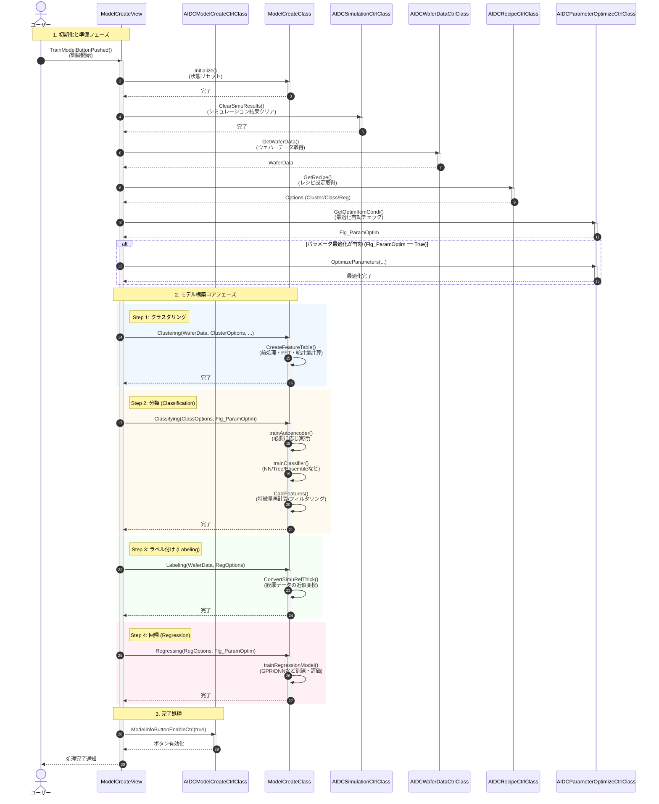

```mermaid
sequenceDiagram
    autonumber
    actor User as ユーザー
    participant View as ModelCreateView
    participant MainCtrl as AIDCModelCreateCtrlClass
    participant Logic as ModelCreateClass
    participant SimCtrl as AIDCSimulationCtrlClass
    participant WaferCtrl as AIDCWaferDataCtrlClass
    participant RecipeCtrl as AIDCRecipeCtrlClass
    participant OptimCtrl as AIDCParameterOptimizeCtrlClass

    Note over User, View: 1. 初期化と準備フェーズ

    User->>View: TrainModelButtonPushed()<br/>(訓練開始)
    activate View

    View->>Logic: Initialize()<br/>(状態リセット)
    activate Logic
    Logic-->>View: 完了
    deactivate Logic

    View->>SimCtrl: ClearSimuResults()<br/>(シミュレーション結果クリア)
    activate SimCtrl
    SimCtrl-->>View: 完了
    deactivate SimCtrl

    View->>WaferCtrl: GetWaferData()<br/>(ウェハーデータ取得)
    activate WaferCtrl
    WaferCtrl-->>View: WaferData
    deactivate WaferCtrl

    View->>RecipeCtrl: GetRecipe()<br/>(レシピ設定取得)
    activate RecipeCtrl
    RecipeCtrl-->>View: Options (Cluster/Class/Reg)
    deactivate RecipeCtrl

    View->>OptimCtrl: GetOptimItemCondi()<br/>(最適化有効チェック)
    activate OptimCtrl
    OptimCtrl-->>View: Flg_ParamOptim
    deactivate OptimCtrl

    alt パラメータ最適化が有効 (Flg_ParamOptim == True)
        View->>OptimCtrl: OptimizeParameters(...)
        activate OptimCtrl
        OptimCtrl-->>View: 最適化完了
        deactivate OptimCtrl
    end

    Note over View, Logic: 2. モデル構築コアフェーズ

    rect rgb(240, 248, 255)
        note right of View: Step 1: クラスタリング
        View->>Logic: Clustering(WaferData, ClusterOptions, ...)
        activate Logic
        Logic->>Logic: CreateFeatureTable()<br/>(前処理・FFT・統計量計算)
        Logic-->>View: 完了
        deactivate Logic
    end

    rect rgb(255, 250, 240)
        note right of View: Step 2: 分類 (Classification)
        View->>Logic: Classifying(ClassOptions, Flg_ParamOptim)
        activate Logic
        Logic->>Logic: trainAutoencoder()<br/>(必要に応じ実行)
        Logic->>Logic: trainClassifier()<br/>(NN/Tree/Ensembleなど)
        Logic->>Logic: CalcFeatures()<br/>(特徴量再計算/フィルタリング)
        Logic-->>View: 完了
        deactivate Logic
    end

    rect rgb(245, 255, 245)
        note right of View: Step 3: ラベル付け (Labeling)
        View->>Logic: Labeling(WaferData, RegOptions)
        activate Logic
        Logic->>Logic: ConvertSimuRefThick()<br/>(膜厚データの近似変換)
        Logic-->>View: 完了
        deactivate Logic
    end

    rect rgb(255, 240, 245)
        note right of View: Step 4: 回帰 (Regression)
        View->>Logic: Regressing(RegOptions, Flg_ParamOptim)
        activate Logic
        Logic->>Logic: trainRegressionModel()<br/>(GPR/DNNなど訓練・評価)
        Logic-->>View: 完了
        deactivate Logic
    end

    Note over View, MainCtrl: 3. 完了処理

    View->>MainCtrl: ModelInfoButtonEnableCtrl(true)
    activate MainCtrl
    MainCtrl-->>View: ボタン有効化
    deactivate MainCtrl

    View-->>User: 処理完了通知
    deactivate View
```
